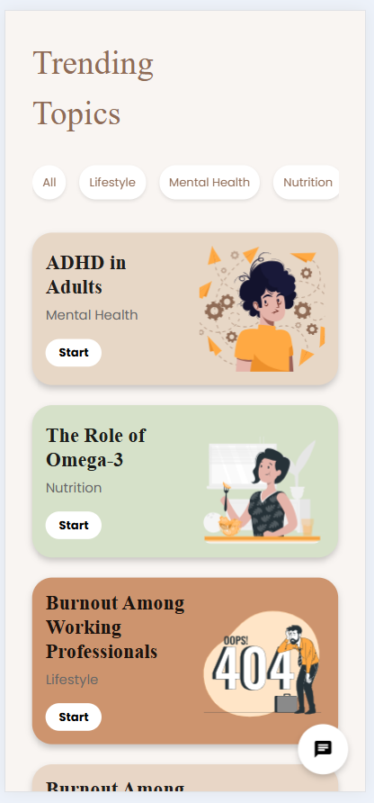

# 🩺 NURI - AI-Powered Content Management for Doctors

 <!-- Replace with your logo or relevant image -->

**NURI** is a revolutionary AI-powered platform designed to help doctors manage their professional websites, educate their patients, and streamline personalized content creation. With trending topics, interactive tools, and a conversational AI assistant, NURI empowers doctors to maintain their professional presence while saving time.

---

## ✨ Why NURI is a Game-Changer for Doctors

- **Stay Ahead in Your Field**: Access trending, evidence-based topics to share with your patients or professional audience.
- **Save Time and Effort**: Automate website updates and content creation to focus on what matters most—patient care.
- **Build Trust and Credibility**: Deliver tailored and reliable resources that strengthen relationships with your patients.
- **Enhanced Patient Engagement**: Provide personalized and interactive experiences for your patients.

---

## 🌟 Features

### 📰 **Trending Topics**
- Discover **trending topics** curated for your specialty.
- Filter topics by categories like:
  - **Lifestyle**
  - **Mental Health**
  - **Nutrition**
- Select a topic and start building a personalized page with pre-structured content.

---

### 🎯 **Personalized Content Pages**
Each topic comes with:
- **Flyers** to share with patients.
- **Trusted sources** like expert contributors and academic publications.
- **Tools and resources** (e.g., daily planners or templates).
- **Products or medications** relevant to the topic.

Doctors can:
- Delete irrelevant cards.
- Rearrange content to tailor the page to their audience.

---

### 🤖 **Conversational AI Assistant**
- Use the **chat circle** to interact with NURI's AI for real-time updates.
- Request tasks such as:
  - **Update Content**: Refine existing text.
  - **Add New Sections**: Expand the page with additional tools or information.
  - **Delete Sections**: Remove irrelevant or outdated content.
- Finalize and approve the page for immediate publishing.

---

## ✨ Why This is Important for Doctors
- **Time-Saving Innovation**: Automates content creation and management, allowing doctors to focus more on patient care.
- **Personalized Patient Education**: Provides tailored resources that improve patient understanding and outcomes.
- **Showcase Expertise**: Helps doctors establish themselves as thought leaders in their fields.
- **Adapt to Digital Healthcare Trends**: Enables doctors to stay competitive in the growing digital health ecosystem.


## 🚀 How It Works

1. **Explore Trending Topics**:
   - Open the app and browse trending topics relevant to your field.
   - Filter topics by categories like **Lifestyle**, **Mental Health**, or **Nutrition**.

2. **Customize the Content Page**:
   - Select a topic to view a pre-structured page with flyers, sources, tools, and product recommendations.
   - Modify the page by deleting, rearranging, or adding cards.

3. **Use AI for Customization**:
   - Engage with NURI's conversational AI by clicking the chat circle.
   - Request content updates, add or delete sections, or ask for formatting adjustments.

4. **Publish and Share**:
   - Publish the page on your professional website or share it directly with your patients.

---
### The project is hosted on Vercel : [AVS](https://avs-three.vercel.app/)


## 🌐 Getting Started

### Prerequisites
Ensure you have the following installed:
[](https://skillicons.dev)

### Installation
1. Clone the repository:
   ```bash
   git clone https://github.com/Leap-Inception/Nuri.git
   ```
2. Navigate to the project directory

```bash
  cd Nuri
```
3. Install the necessary dependencies
```bash
  npm install
```

4. Start the development server
```bash
  npm start
```

The website should now be up and running on http://localhost:3000.

## 🏠 Built With:

[](https://skillicons.dev)

## 🛠 Skills

[](https://skillicons.dev)

## 🚀 About Us
Specializations:
- UI/UX Design.
- Web Development


<!-- This is a comment
## 🙋‍♂️ Connect With Me

<p align="left">
  <a href="https://skillicons.dev">
    <a href="https://github.com/omunite215">
      
    </a>
  </a>
   <a href="https://skillicons.dev">
    <a href="https://www.linkedin.com/in/om-patel-401068143/">
      
    </a>
  </a>
  <a href="https://skillicons.dev">
    <a href="https://www.instagram.com/_21omp/">
      
    </a>
  </a>
   <a href="https://skillicons.dev">
    <a href="https://portfoliobyom.netlify.app/">
      
    </a>
  </a>
</p>
-->


## 🗒️ Authors
- The Leap Studio

<p align="left">
  <a href="https://github.com/LeapsTeam">
    <a href="https://github.com/LeapsTeam">
      
    </a>
  </a>
</p>

<p align="center">
  
</p>